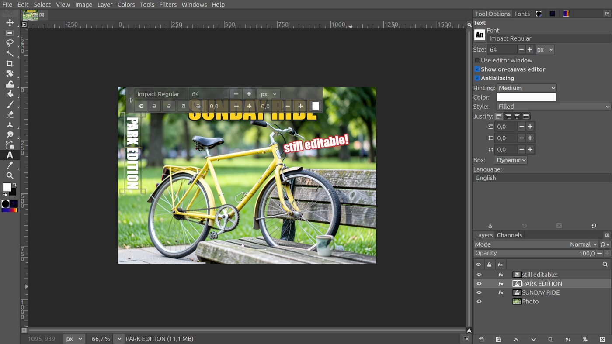
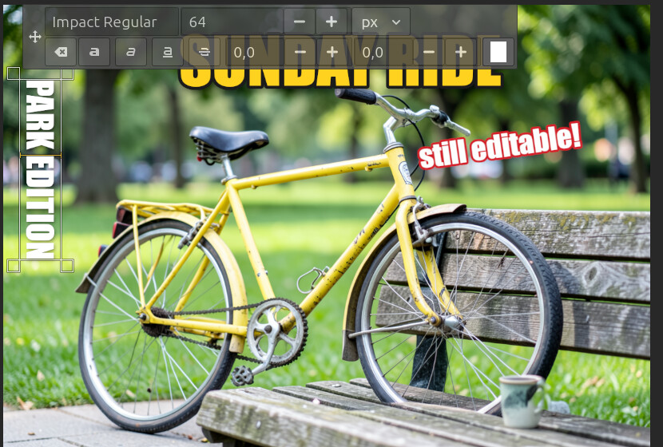
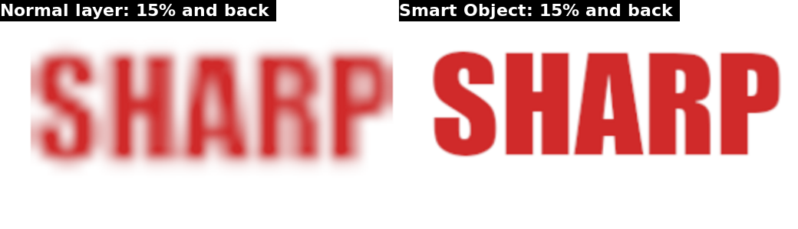
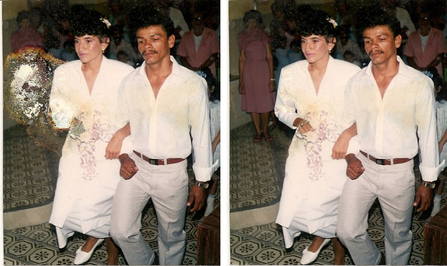

# GIMP Setup


> **Want the full Photoshop experience?** Use
> [GIMPhoto](https://github.com/diegochagas/gimphoto), a fork of GIMP with
> Photoshop's tools and interface built in (fx button and effects in the
> Layers panel, shape tools in the toolbox, Photoshop's shortcuts and
> layout), installed next to the official GIMP. gimp-setup adds what a
> plug-in can to the GIMP you already have.

One-command installer for the complete GIMP ecosystem on Linux:
Flatpak GIMP 3, plug-ins, brushes, presets and extra features such as
Photoshop-style shortcuts and fully local AI tools.

Companion project of
[linux-mint-setup](https://github.com/diegochagas/linux-mint-setup), which
runs this setup automatically as part of a full machine install. It also
works standalone on any distribution with Flatpak.

## Installation

Run everything with a single command:

```bash
git clone https://github.com/diegochagas/gimp-setup.git && cd gimp-setup && ./setup.sh
```

To preview the actions without changing anything:

```bash
./setup.sh --dry-run
```

The script is idempotent: run it again at any time to add what is missing.
Each run writes a log to `logs/`.

### Requirements

`curl`, `unzip`, `jq`, `git`, `flatpak` and `python3` must be available.
No `sudo` is required — everything installs to Flatpak and the user home.

This installs on top of whatever machine already runs Flatpak, so there's
no separate hardware bar beyond what GIMP itself needs:

| Resource | Minimum | Comfortable |
| --- | --- | --- |
| RAM | 4 GB | 8 GB+ — large images with G'MIC, Resynthesizer and the LinuxBeaver GEGL filters all in play |
| Disk (free space) | ~2 GB | 5 GB+ — GIMP plus all the plug-ins/brushes/presets this script adds |
| CPU | 64-bit CPU | — |
| GPU | None required | — |

The AI plug-ins never run inference inside GIMP: Generative Fill, AI
Remove Selection, AI Restore Photo and AI Object Selection use a
local [ComfyUI](https://github.com/comfyanonymous/ComfyUI) server running
FLUX.2 klein or Qwen-Image-Edit. That ComfyUI is the one heavy piece (about
42 GB of disk and an NVIDIA GPU; the
[examples below](#local-ai-models-comfyui) were made on a 6 GB laptop GPU),
and this setup does not install it:
[linux-mint-setup](https://github.com/diegochagas/linux-mint-setup#local-ai-image-models-comfyui)
does, as a `comfyui` user service that gimp-setup finds by itself. Without
it the AI tools work against any ComfyUI you already run (`COMFYUI_URL`).

### Configuration

Optional. Copy the example file and fill in your values:

```bash
cp config.sh.example config.sh
```

| Variable               | Purpose                                                                    |
| ---------------------- | -------------------------------------------------------------------------- |
| `COMFYUI_URL`          | ComfyUI server the AI tools use (default: the local `comfyui` service)     |
| `COMFYUI_START_WITH_GIMP` | `no`: GIMP does not start and stop the local ComfyUI (default `yes`)    |

The ComfyUI address is written to
`~/.config/PhotoGIMP/comfyui-url` on the host **and** inside the
GIMP Flatpak sandbox, where every AI plug-in finds them (see
[docs/AI_PLUGINS.md](docs/AI_PLUGINS.md)).

`config.sh` is gitignored. Every variable also falls back to an environment
variable of the same name, so a parent script can `export COMFYUI_URL=...`
and run `./setup.sh` without creating a `config.sh`.

## What `setup.sh` Does

The script stops if an unhandled command fails. It checks the dependencies,
the internet connection and the Flathub remote, then installs **all the
features** found in `features/`, in priority order. Everything the setup
does — including the GIMP install itself — is a feature file.

## Features

Every `features/*.sh` file is a self-contained part of the GIMP ecosystem:
the GIMP install, plug-ins, resources, shortcuts, menu options. New features
are added by dropping a new file into `features/`, without touching
`setup.sh`.

A feature file defines:

```bash
FEATURE_NAME="My Feature"       # Display name for logs and summary
FEATURE_PRIORITY=65             # Execution order (lower runs first;
                                # optional, default 50)

feature_install() {             # The work, using setup.sh helpers:
    ...                         # run, print_info, file_exists,
}                               # install_flatpak_package,
                                # gimp_profile_dirs, SUMMARY, DRY_RUN...
```

Features must be idempotent and honor `--dry-run` (use the `run` helper for
commands and guard direct file writes with `DRY_RUN`).

### Included Features

| Priority | Feature                                              | What it installs                                        | Docs                                                 |
| -------- | ---------------------------------------------------- | ------------------------------------------------------- | ---------------------------------------------------- |
| 10       | [`gimp.sh`](features/gimp.sh)                         | Flatpak GIMP + G'MIC + Resynthesizer                    | [GIMP.md](docs/GIMP.md)                               |
| 30       | [`photogimp.sh`](features/photogimp.sh)               | Photoshop-inspired interface and configuration          | [PHOTOGIMP.md](docs/PHOTOGIMP.md)                     |
| 40       | [`photoshop-keymap.sh`](features/photoshop-keymap.sh) | Photoshop keyboard shortcuts (shortcutsrc + controllerrc) | [PHOTOSHOP_KEYMAP.md](docs/PHOTOSHOP_KEYMAP.md)     |
| 40       | [`slos-gimpainter.sh`](features/slos-gimpainter.sh)   | Painting brushes, dynamics and tool presets             | [SLOS_GIMPAINTER.md](docs/SLOS_GIMPAINTER.md)         |
| 45       | [`photoshop-theme.sh`](features/photoshop-theme.sh)   | Photoshop look: theme, pasteboard colour, named dock tabs | [PHOTOSHOP_THEME.md](docs/PHOTOSHOP_THEME.md)       |
| 46       | [`gimp-tab-keys.sh`](features/gimp-tab-keys.sh)       | Ctrl+Tab / Ctrl+Shift+Tab switch image tabs, also on the canvas (X11 helper) | [PHOTOSHOP_KEYMAP.md](docs/PHOTOSHOP_KEYMAP.md) |
| 50       | [`linuxbeaver.sh`](features/linuxbeaver.sh)           | LinuxBeaver GEGL effect plug-ins                        | [LINUXBEAVER.md](docs/LINUXBEAVER.md)                 |
| 55       | [`psd-text.sh`](features/psd-text.sh)                 | PSD open/export with editable text both ways (Type layers ⇄ GIMP text) | [PSD_TEXT.md](docs/PSD_TEXT.md)        |
| 55       | [`layer-style.sh`](features/layer-style.sh)           | Layer > Layer Style: Photoshop's fx dialog (shadows, stroke, glows, bevel, overlays) | [LAYER_STYLE.md](docs/LAYER_STYLE.md) |
| 55       | [`shape-tool.sh`](features/shape-tool.sh)             | Photoshop's shape tools (U): rectangle, ellipse, triangle, polygon, line, custom shapes as vector layers | [SHAPE_TOOL.md](docs/SHAPE_TOOL.md) |
| 55       | [`layer-via.sh`](features/layer-via.sh)               | Layer via Copy / Cut (Ctrl+J / Ctrl+Shift+J): a new layer from the selected area, in place | [LAYER_VIA.md](docs/LAYER_VIA.md) |
| 55       | [`smart-objects.sh`](features/smart-objects.sh)       | Layer > Smart Object: Convert / Edit / Replace Contents (link layers) | [SMART_OBJECTS.md](docs/SMART_OBJECTS.md) |
| 60       | [`ai-plugins.sh`](features/ai-plugins.sh)             | The four AI plug-ins (fully local) + shared settings  | [AI_PLUGINS.md](docs/AI_PLUGINS.md)           |
| 62       | [`comfyui-nodes.sh`](features/comfyui-nodes.sh)       | gimp-setup's own node in the local ComfyUI (Object Selection) | [Local AI models](#local-ai-models-comfyui) |
| 65       | [`comfyui-with-gimp.sh`](features/comfyui-with-gimp.sh) | Starts ComfyUI with GIMP, stops it when GIMP closes | [AI_PLUGINS.md](docs/AI_PLUGINS.md#fully-local-ai-comfyui) |

The order matters: GIMP is installed first; PhotoGIMP layers its
configuration on top; the Photoshop keymap runs after PhotoGIMP on purpose
so its shortcuts win; the AI plug-ins run last so their files survive the
configuration overwrites.

#### GIMP (Flatpak) — `features/gimp.sh`

GIMP from Flathub with the G'MIC and Resynthesizer plug-ins. The plug-in
branches follow the installed GIMP's **major version** (Flathub publishes
them as branch `3`, not `stable`). Resynthesizer adds
`Filters > Enhance > Heal Selection`. See [docs/GIMP.md](docs/GIMP.md).

#### PhotoGIMP — `features/photogimp.sh`

[PhotoGIMP 3.0](https://github.com/Diolinux/PhotoGIMP): a Photoshop-inspired
interface and configuration for Flatpak GIMP. An existing GIMP 3.0
configuration is backed up to a timestamped folder first. See
[docs/PHOTOGIMP.md](docs/PHOTOGIMP.md).

#### SLOS-GIMPainter — `features/slos-gimpainter.sh`

The [SLOS-GIMPainter](https://github.com/SenlinOS/SLOS-GIMPainter) brush,
dynamics and tool-preset package, registered in GIMP's `gimprc`. See
[docs/SLOS_GIMPAINTER.md](docs/SLOS_GIMPAINTER.md).

#### LinuxBeaver GEGL Plug-ins — `features/linuxbeaver.sh`

The [LinuxBeaver](https://github.com/LinuxBeaver/LinuxBeaver) GEGL effect
collection (`Filters > Text Styling`, `Filters > Render > Fun`, ...), with a
manifest so reruns replace stale binaries cleanly. See
[docs/LINUXBEAVER.md](docs/LINUXBEAVER.md).

#### Photoshop Keymap — `features/photoshop-keymap.sh`

Two layers, installed into every GIMP 3.x profile with timestamped
backups (details and customization in
[docs/PHOTOSHOP_KEYMAP.md](docs/PHOTOSHOP_KEYMAP.md)):

- **Photoshop keymap for GIMP** — the community
  [photoshop-keymap-for-gimp](https://github.com/loloolooo/photoshop-keymap-for-gimp)
  (`shortcutsrc` + `controllerrc`, pinned to a commit and sanitized of a
  malformed upstream line). GIMP's shortcuts follow Photoshop's and show
  next to the menu entries like in Photoshop: `Ctrl+Alt+I` Image Size,
  `Ctrl+Alt+C` Canvas Size, `Ctrl+L` Levels, `Ctrl+E` Merge Down...
- **Keymap Extras** — extra bindings for GIMP-only actions, layered on
  top through the `PHOTOSHOP_KEYMAP_EXTRAS` array on shortcuts nothing
  else uses: `Ctrl+Alt+E` File > Overwrite, `Ctrl+Alt+Shift+W`
  File > Export As and `Ctrl+Tab` / `Ctrl+Shift+Tab` next / previous
  image tab as in Photoshop; on the canvas these need the small X11 helper
  of `features/gimp-tab-keys.sh`, because GIMP hard-wires Ctrl+Tab there to
  its layer picker.

#### Photoshop Theme — `features/photoshop-theme.sh`

A "Photoshop" GIMP theme modelled on Photoshop's medium gray interface
(`#535353` panels, darker tab strips, flat borderless icon buttons, Adobe
blue for selection and focus), Photoshop's `#282828` pasteboard around the
image, and dock tabs that show their name (*Layers*, *Channels*, *Paths*)
instead of only an icon. See [docs/PHOTOSHOP_THEME.md](docs/PHOTOSHOP_THEME.md).



#### PSD with editable text — `features/psd-text.sh`

Opening a `.psd` turns its Type layers into GIMP text layers (and Layer
Style strokes and shadows into Text Styling filters) instead of pixels;
exporting to `.psd` writes GIMP text layers as Type layers Photoshop can
still edit. Text rotated 90° opens as vertical text; tilted or squeezed text
as a smart object, both still editable, and Layer Styles open as editable
[Layer Styles](docs/LAYER_STYLE.md).

 Needs Node.js on the host. See [docs/PSD_TEXT.md](docs/PSD_TEXT.md).

#### Smart Objects — `features/smart-objects.sh`

*Layer > Smart Object > Convert to Smart Object / Edit Contents / Replace
Contents*, on GIMP 3.2's link layers: non-destructive transforms, and
saving the contents file updates every layer that shows it. See
[docs/SMART_OBJECTS.md](docs/SMART_OBJECTS.md).



#### Layer Style — `features/layer-style.sh`

Photoshop's Layer Style dialog (fx): *Layer > Layer Style > Blending
Options… / Drop Shadow… / Stroke… / …*, with Photoshop's settings (angle,
distance, spread, size, Use Global Light…), live preview, OK/Cancel as one
undo step, Copy / Paste / Clear Layer Style. Every effect is a
non-destructive filter, listed in the Layers panel's fx column. See
[docs/LAYER_STYLE.md](docs/LAYER_STYLE.md).


#### Shape Tool — `features/shape-tool.sh`

Photoshop's shape tools behind **U** (and *Tools > Shape Tool…*):
Rectangle (corner radius), Ellipse, Triangle, Polygon (sides, star), Line
and Custom Shape (heart, star, arrow, speech bubble, burst, check mark,
lightning, cross), with fill and stroke, previewed live. The shape fills
the current selection (or the middle of the image) and becomes a GIMP 3.2
vector layer: crisp at any size, points editable with the Path tool, `U`
on it edits it again. See [docs/SHAPE_TOOL.md](docs/SHAPE_TOOL.md).


GIMP must be closed while this feature runs.

#### Layer via Copy / Cut — `features/layer-via.sh`

Photoshop's **Ctrl+J** / **Ctrl+Shift+J**: with a selection, a new layer
with only the selected area, in place (Cut also clears it from the
original); without one, Ctrl+J duplicates the layer. See
[docs/LAYER_VIA.md](docs/LAYER_VIA.md).

#### AI Plug-ins — `features/ai-plugins.sh`

The four AI plug-ins, installed as one feature (details in
[docs/AI_PLUGINS.md](docs/AI_PLUGINS.md)). Everything runs on this machine:
no account, no API key, nothing is uploaded.

- **Generative Fill** — `Filters > AI > Generative Fill…`. Fills the
  selection from a text prompt; also Image Generator. Vendored patched
  [GIMP AI Plugin](https://github.com/lukaso/gimp-ai) on the local ComfyUI
  models (FLUX.2 klein or Qwen-Image-Edit).
- **AI Remove Selection** — `Filters > AI > Remove Selection (AI)…`.
  Photoshop-style Remove tool from PhotoGIMP: Quick Mask-paint the object,
  run, gone. Same two local models.
- **AI Restore Photo** — `Filters > AI > Restore Photo (AI)…`. Repairs a
  scanned photo print (blotches, stains, scratches, specks, or chemical
  burns) with the [photo-restore](https://github.com/diegochagas/photo-restore)
  method: the model's pixels are kept only where the print was damaged,
  as a new layer whose mask you can paint. Same two local models.
- **AI Object Selection** — `Select > Object Selection (AI)` and
  `Select > Subject (AI)`. Photoshop's Object Selection tool: draw a rough
  rectangle or lasso around an object, run, and the selection snaps to it
  (SAM 2.1, local).

  

The shared settings from `config.sh` (the server URLs) are written for all
of them, host and Flatpak sandbox alike. Earlier versions also offered
OpenAI, Google Gemini and Stable Diffusion WebUI; those were removed, and
the setup deletes the API keys they had saved.

#### Local AI models (ComfyUI)

The AI tools run on a local
[ComfyUI](https://github.com/comfyanonymous/ComfyUI) server serving
open-weight image models (FLUX.2 klein, Qwen-Image-Edit, SAM 2.1), with no
accounts, credits or limits. **This setup does not install it:**
[linux-mint-setup](https://github.com/diegochagas/linux-mint-setup#local-ai-image-models-comfyui)
does (its `steps/comfyui`: ComfyUI, its GGUF and SAM 2 nodes, the model sets
and a `comfyui` systemd user service, not enabled at boot). gimp-setup finds
that ComfyUI through the service, so it needs no setting of its own:

- `features/comfyui-nodes.sh` adds gimp-setup's own `GimpSetupBBox` node
  ([`assets/comfyui/custom_nodes`](assets/comfyui/custom_nodes)), used by
  Object Selection, to it;
- the AI tools use the service's address (`COMFYUI_URL` overrides it).

**ComfyUI starts and stops with GIMP** (`features/comfyui-with-gimp.sh`):
the GIMP menu entry runs `gimp-with-comfyui`, which starts the service,
runs GIMP and, once the last GIMP window closes, stops it again, freeing
the GPU memory and the up to ~23 GB of RAM a loaded model (Qwen) holds. A
tool used while ComfyUI is still booting waits for it. A ComfyUI you
started yourself keeps running after GIMP closes.
`COMFYUI_START_WITH_GIMP=no` turns this off; then start it by hand (GIMP's
Flatpak sandbox cannot), as below.

```bash
systemctl --user start comfyui     # then open http://127.0.0.1:8188
systemctl --user stop comfyui      # frees the GPU and the RAM
systemctl --user status comfyui    # is it running?
```

Pick a model in the Remove Selection dialog or in `Filters > AI > Settings`;
the model files are found by name in what the server has installed. Setup,
timings and limits are in
[docs/AI_PLUGINS.md](docs/AI_PLUGINS.md#fully-local-ai-comfyui). To use a
ComfyUI you already run instead, set `COMFYUI_URL`.

In the ComfyUI web interface, open a workflow from **Templates** (for
example "Qwen Image Edit"), pick the installed model files in the loader
nodes, load an image, write the instruction and run. Results are saved in
the `output/` folder of ComfyUI's install.

Scripts can also drive it through its HTTP API, and start the service
themselves. That is what
[comic-skills](https://github.com/diegochagas/comic-skills) does to erase
text from comic pages without paying for an image API:

```bash
INPAINT=qwen COMFYUI_SERVICE=comfyui \
  ~/Projects/comic-skills/venv/bin/python \
  ~/Projects/comic-skills/clean-texts/scripts/clean_texts.py "<folder>" --backend local
```

The examples below were all made locally with these models on a laptop
RTX 3050 (6 GB): 12–35 s per edit with FLUX.2 klein, 70–125 s with
Qwen-Image-Edit.

**Remove Selection (AI)** — select the object (red = the Quick Mask
selection), run, and the background behind it is rebuilt:


It also removes **text or marks printed over a texture**, continuing the
print's own halftone pattern. *What is selected: Auto* tries the object
method first and switches to the texture method by itself when the fill
comes back flat:


**Restore Photo (AI)** — a scanned print goes in; the model's repair is
added as a layer masked to the damage it fixed, the rest of the scan stays
exactly as it was. Details and options in
[docs/AI_PLUGINS.md](docs/AI_PLUGINS.md#ai-restore-photo).



**Generative Fill** — the prompt replaces what is selected… (prompt: *a
sleeping orange cat curled up on the bench*)


…or adds something new on the real background, kept whole inside the
selection (prompt: *a shiny golden five-pointed star*, both models):


It also **continues the picture into a blank border** (white, transparent,
or a canvas made bigger): select the blank part and prompt `continue the
image` (or `extend the background`, `continuar a imagem`, `fill`). Details
in [docs/AI_PLUGINS.md](docs/AI_PLUGINS.md#generative-fill).

## Notes

- If GIMP has not been opened before the setup runs, the features that need
  an existing GIMP profile are skipped with a warning. Open GIMP once, close
  it, and re-run `./setup.sh`.
- The GEGL plug-in directory must contain only `.so` files at its top level.
  Subdirectories or other file types may prevent GIMP from starting.
- The script downloads software from third-party projects, so review the
  feature files before running it.
