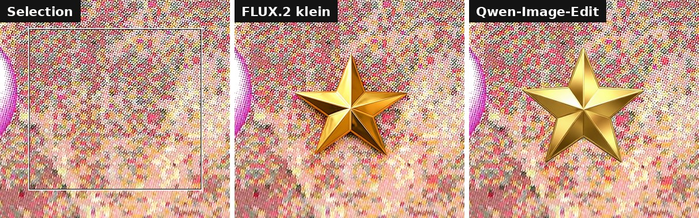

# GIMP Setup


One-command installer for the complete GIMP ecosystem on Linux:
Flatpak GIMP 3, plug-ins, brushes, presets and extra features such as
Photoshop-style shortcuts and AI tools.

Companion project of
[linux-mint-setup](https://github.com/diegochagas/linux-mint-setup), which
runs this setup automatically as part of a full machine install. It also
works standalone on any distribution with Flatpak.

## Installation

Run everything with a single command:

```bash
git clone https://github.com/diegochagas/gimp-setup.git && cd gimp-setup && ./setup.sh
```

To preview the actions without changing anything:

```bash
./setup.sh --dry-run
```

The script is idempotent: run it again at any time to add what is missing.
Each run writes a log to `logs/`.

### Requirements

`curl`, `unzip`, `jq`, `git`, `flatpak` and `python3` must be available.
No `sudo` is required — everything installs to Flatpak and the user home.

This installs on top of whatever machine already runs Flatpak, so there's
no separate hardware bar beyond what GIMP itself needs:

| Resource | Minimum | Comfortable |
| --- | --- | --- |
| RAM | 4 GB | 8 GB+ — large images with G'MIC, Resynthesizer and the LinuxBeaver GEGL filters all in play |
| Disk (free space) | ~2 GB | 5 GB+ — GIMP plus all the plug-ins/brushes/presets this script adds |
| CPU | 64-bit CPU | — |
| GPU | None required | — |

The AI plug-ins never run inference inside GIMP: WithoutBG needs a
reachable server (local Docker/Mac app by default, per
`WITHOUTBG_SERVER_URL`), and Generative Fill/AI Remove Selection call
OpenAI, Gemini or a server of your own — so this repo adds no GPU/VRAM
requirement. Going **fully local** is optional: point them at a
[ComfyUI](https://github.com/comfyanonymous/ComfyUI) running FLUX.2 klein
or Qwen-Image-Edit, and the GPU requirement is that server's (the
[examples below](#ai-plug-ins--featuresai-pluginssh) were made on a
6 GB laptop GPU).

### Configuration

Optional. Copy the example file and fill in your values:

```bash
cp config.sh.example config.sh
```

| Variable               | Purpose                                                                    |
| ---------------------- | -------------------------------------------------------------------------- |
| `GEMINI_API_KEY`       | Free key for the Gemini provider — saved to the shared key files           |
| `OPENAI_API_KEY`       | Paid key for the OpenAI provider — saved to the shared key files           |
| `WITHOUTBG_SERVER_URL` | WithoutBG server used by the background removal plug-in (default: local)   |
| `COMFYUI_URL`          | ComfyUI server for the fully local AI backends (default: ComfyUI's own)    |

They are written to `~/.config/PhotoGIMP/{gemini,openai}-api-key`,
`~/.config/PhotoGIMP/withoutbg-server-url` and
`~/.config/PhotoGIMP/comfyui-url` on the host **and** inside the
GIMP Flatpak sandbox, where every AI plug-in finds them (see
[docs/AI_PLUGINS.md](docs/AI_PLUGINS.md)).

`config.sh` is gitignored. Every variable also falls back to an environment
variable of the same name, so a parent script can `export GEMINI_API_KEY=...`
and run `./setup.sh` without creating a `config.sh`.

## What `setup.sh` Does

The script stops if an unhandled command fails. It checks the dependencies,
the internet connection and the Flathub remote, then installs **all the
features** found in `features/`, in priority order. Everything the setup
does — including the GIMP install itself — is a feature file.

## Features

Every `features/*.sh` file is a self-contained part of the GIMP ecosystem:
the GIMP install, plug-ins, resources, shortcuts, menu options. New features
are added by dropping a new file into `features/`, without touching
`setup.sh`.

A feature file defines:

```bash
FEATURE_NAME="My Feature"       # Display name for logs and summary
FEATURE_PRIORITY=65             # Execution order (lower runs first;
                                # optional, default 50)

feature_install() {             # The work, using setup.sh helpers:
    ...                         # run, print_info, file_exists,
}                               # install_flatpak_package,
                                # gimp_profile_dirs, SUMMARY, DRY_RUN...
```

Features must be idempotent and honor `--dry-run` (use the `run` helper for
commands and guard direct file writes with `DRY_RUN`).

### Included Features

| Priority | Feature                                              | What it installs                                        | Docs                                                 |
| -------- | ---------------------------------------------------- | ------------------------------------------------------- | ---------------------------------------------------- |
| 10       | [`gimp.sh`](features/gimp.sh)                         | Flatpak GIMP + G'MIC + Resynthesizer                    | [GIMP.md](docs/GIMP.md)                               |
| 30       | [`photogimp.sh`](features/photogimp.sh)               | Photoshop-inspired interface and configuration          | [PHOTOGIMP.md](docs/PHOTOGIMP.md)                     |
| 40       | [`photoshop-keymap.sh`](features/photoshop-keymap.sh) | Photoshop keyboard shortcuts (shortcutsrc + controllerrc) | [PHOTOSHOP_KEYMAP.md](docs/PHOTOSHOP_KEYMAP.md)     |
| 40       | [`slos-gimpainter.sh`](features/slos-gimpainter.sh)   | Painting brushes, dynamics and tool presets             | [SLOS_GIMPAINTER.md](docs/SLOS_GIMPAINTER.md)         |
| 50       | [`linuxbeaver.sh`](features/linuxbeaver.sh)           | LinuxBeaver GEGL effect plug-ins                        | [LINUXBEAVER.md](docs/LINUXBEAVER.md)                 |
| 60       | [`ai-plugins.sh`](features/ai-plugins.sh)             | The three AI plug-ins (online or fully local) + shared settings | [AI_PLUGINS.md](docs/AI_PLUGINS.md)           |

The order matters: GIMP is installed first; PhotoGIMP layers its
configuration on top; the Photoshop keymap runs after PhotoGIMP on purpose
so its shortcuts win; the AI plug-ins run last so their files survive the
configuration overwrites.

#### GIMP (Flatpak) — `features/gimp.sh`

GIMP from Flathub with the G'MIC and Resynthesizer plug-ins. The plug-in
branches follow the installed GIMP's **major version** (Flathub publishes
them as branch `3`, not `stable`). Resynthesizer adds
`Filters > Enhance > Heal Selection`. See [docs/GIMP.md](docs/GIMP.md).

#### PhotoGIMP — `features/photogimp.sh`

[PhotoGIMP 3.0](https://github.com/Diolinux/PhotoGIMP): a Photoshop-inspired
interface and configuration for Flatpak GIMP. An existing GIMP 3.0
configuration is backed up to a timestamped folder first. See
[docs/PHOTOGIMP.md](docs/PHOTOGIMP.md).

#### SLOS-GIMPainter — `features/slos-gimpainter.sh`

The [SLOS-GIMPainter](https://github.com/SenlinOS/SLOS-GIMPainter) brush,
dynamics and tool-preset package, registered in GIMP's `gimprc`. See
[docs/SLOS_GIMPAINTER.md](docs/SLOS_GIMPAINTER.md).

#### LinuxBeaver GEGL Plug-ins — `features/linuxbeaver.sh`

The [LinuxBeaver](https://github.com/LinuxBeaver/LinuxBeaver) GEGL effect
collection (`Filters > Text Styling`, `Filters > Render > Fun`, ...), with a
manifest so reruns replace stale binaries cleanly. See
[docs/LINUXBEAVER.md](docs/LINUXBEAVER.md).

#### Photoshop Keymap — `features/photoshop-keymap.sh`

Two layers, installed into every GIMP 3.x profile with timestamped
backups (details and customization in
[docs/PHOTOSHOP_KEYMAP.md](docs/PHOTOSHOP_KEYMAP.md)):

- **Photoshop keymap for GIMP** — the community
  [photoshop-keymap-for-gimp](https://github.com/loloolooo/photoshop-keymap-for-gimp)
  (`shortcutsrc` + `controllerrc`, pinned to a commit and sanitized of a
  malformed upstream line). GIMP's shortcuts follow Photoshop's and show
  next to the menu entries like in Photoshop: `Ctrl+Alt+I` Image Size,
  `Ctrl+Alt+C` Canvas Size, `Ctrl+L` Levels, `Ctrl+E` Merge Down...
- **Keymap Extras** — extra bindings for GIMP-only actions, layered on
  top through the `PHOTOSHOP_KEYMAP_EXTRAS` array on shortcuts nothing
  else uses: `Ctrl+Alt+E` File > Overwrite and `Ctrl+Alt+Shift+W`
  File > Export As.

GIMP must be closed while this feature runs.

#### AI Plug-ins — `features/ai-plugins.sh`

The three AI plug-ins, installed as one feature (details and API key setup
in [docs/AI_PLUGINS.md](docs/AI_PLUGINS.md)):

- **WithoutBG** — `Tools > WithoutBG > Remove Background…`. Cuts out the
  subject via the WithoutBG server set in `WITHOUTBG_SERVER_URL` and adds
  the matte as an unapplied layer mask. No key needed.
- **Generative Fill** — `Filters > AI > Generative Fill…`. Fills the
  selection from a text prompt; also Image Generator and Layer Composite.
  Vendored patched [GIMP AI Plugin](https://github.com/lukaso/gimp-ai)
  with a provider switch: OpenAI (default), Gemini, ComfyUI (local) or
  SD WebUI (local).
- **AI Remove Selection** — `Filters > AI > Remove Selection (AI)…`.
  Photoshop-style Remove tool from PhotoGIMP: Quick Mask-paint the object,
  run, gone. Backends: Gemini, ComfyUI (local), IOPaint (local), SD WebUI
  (local).

Shared settings from `config.sh` (API keys and the server URLs) are
written for all of them, host and Flatpak sandbox alike.

##### Fully local AI (ComfyUI)

Both tools can run with **no cloud service at all** on a local
[ComfyUI](https://github.com/comfyanonymous/ComfyUI) server, with either
**FLUX.2 klein** (fast) or **Qwen-Image-Edit** + its Lightning 4-step LoRA
(slower). Start ComfyUI, pick a *ComfyUI* backend in the Remove Selection
dialog or a *ComfyUI* provider in `Filters > AI > Settings`, and nothing
leaves the machine. The model files are found by name in what the server
has installed; no key, no account. Setup, timings and limits are in
[docs/AI_PLUGINS.md](docs/AI_PLUGINS.md#fully-local-ai-comfyui).

This repo installs the GIMP side only — **ComfyUI and its models are not
installed here**. Use any ComfyUI you already run, or let
[linux-mint-setup](https://github.com/diegochagas/linux-mint-setup#local-image-generation-and-editing-comfyui)
install it (ComfyUI, the ComfyUI-GGUF node, both model sets verified by
checksum, and a `comfyui` user service; about 42 GB, NVIDIA GPU). ComfyUI
has to be **running while the tools are used** — GIMP's Flatpak sandbox
cannot start it. With that service:

```bash
systemctl --user start comfyui     # before using the ComfyUI backends
systemctl --user stop comfyui      # when done: frees the GPU and the RAM
```

Installed another way, start it however you normally do (for example
`python main.py` in its folder); a model stays loaded, holding GPU memory
and up to ~23 GB of RAM, until ComfyUI stops.

The examples below were all made locally with these backends on a laptop
RTX 3050 (6 GB): 12–35 s per edit with FLUX.2 klein, 70–125 s with
Qwen-Image-Edit.

**Remove Selection (AI)** — select the object (red = the Quick Mask
selection), run, and the background behind it is rebuilt:


It also removes **text or marks printed over a texture**, continuing the
print's own halftone pattern. *What is selected: Auto* tries the object
method first and switches to the texture method by itself when the fill
comes back flat:


**Generative Fill** — the prompt replaces what is selected… (prompt: *a
sleeping orange cat curled up on the bench*)


…or adds something new on the real background, kept whole inside the
selection (prompt: *a shiny golden five-pointed star*, both models):



## Notes

- If GIMP has not been opened before the setup runs, the features that need
  an existing GIMP profile are skipped with a warning. Open GIMP once, close
  it, and re-run `./setup.sh`.
- The GEGL plug-in directory must contain only `.so` files at its top level.
  Subdirectories or other file types may prevent GIMP from starting.
- The script downloads software from third-party projects, so review the
  feature files before running it.
