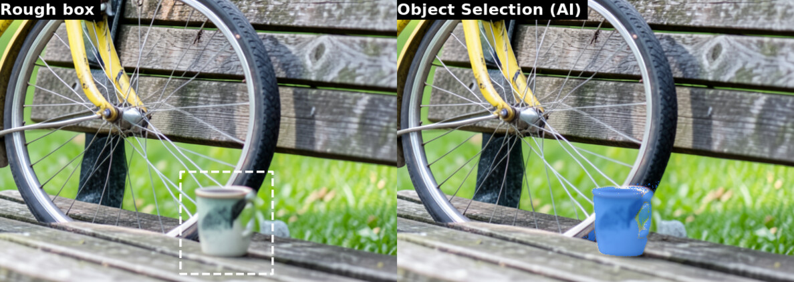

# AI Plug-ins — `features/ai-plugins.sh`

One feature installs the five AI plug-ins and their shared settings.
After restarting GIMP, Generative Fill, AI Remove Selection and AI
Restore Photo appear under **Filters → AI**; Object Selection and Subject
under **Select**; WithoutBG under **Tools → WithoutBG**.

Everything runs on this machine: Generative Fill, AI Remove Selection, AI
Restore Photo and AI Object Selection use the local ComfyUI models (installed by `features/comfyui.sh`), so there
is no account, no API key and nothing is uploaded.

| Tool | What it does | Runs on |
|---|---|---|
| **WithoutBG** | Cuts the subject out: adds the alpha matte as an unapplied layer mask | WithoutBG server from `WITHOUTBG_SERVER_URL` |
| **Generative Fill** | Fills the **selection** from a **text prompt**; also *Image Generator* (text → new layer) | ComfyUI (local): FLUX.2 klein or Qwen-Image-Edit |
| **AI Remove Selection** | Photoshop-style **Remove tool**: select (or Quick Mask-paint) an object, run, it's gone | ComfyUI (local): FLUX.2 klein or Qwen-Image-Edit |
| **AI Restore Photo** | Repairs a **scanned photo print**: blotches, stains, scratches, specks (or chemical burns) repainted, the rest of the scan untouched | ComfyUI (local): FLUX.2 klein or Qwen-Image-Edit |
| **AI Object Selection** | Photoshop's **Object Selection** tool and **Select Subject**: a rough box or lasso around an object becomes a selection of the object | ComfyUI (local): SAM 2.1 |

## The tools

### WithoutBG (background removal)

A **vendored, patched** copy of
[withoutbg/withoutbg-gimp](https://github.com/withoutbg/withoutbg-gimp)
(GPL v3+) from `assets/vendor/withoutbg/` — see
[PATCHES.md](../assets/vendor/withoutbg/PATCHES.md) for the diff. It
targets the WithoutBG API set in `WITHOUTBG_SERVER_URL` in `config.sh`
— your own self-hosted instance, or a local server (Docker or the Mac
app) by default. No key needed, and the URL can still be changed per run
in the dialog.

Usage: **Tools → WithoutBG → Remove Background…** — the matte comes back
as an *unapplied* layer mask so you can review or tweak it, then commit
with *Layer → Mask → Apply Layer Mask*.

It replaces the old rembg-based *AI Remove Background* plug-in, which the
setup removes from the GIMP profiles automatically.

### Generative Fill (GIMP AI Plugin)

A **vendored, patched** copy of [lukaso/gimp-ai](https://github.com/lukaso/gimp-ai)
v0.14.0 (MIT) from `assets/vendor/gimp-ai-plugin/` — see
[PATCHES.md](../assets/vendor/gimp-ai-plugin/PATCHES.md) for the diff:

- *AI Inpainting* is renamed **Generative Fill** (Photoshop's name).
- **Local models only**: a **model selector** in *Filters → AI → Settings*
  switches between ComfyUI FLUX.2 klein and Qwen-Image-Edit for Generative
  Fill and the Image Generator. The plug-in's online options (OpenAI,
  Gemini, Stable Diffusion WebUI) and its OpenAI-only *Layer Composite*
  were removed.
- A fix for an upstream bug that left the edit mask **empty** in Focused
  mode unless the selection sat at the image's top-left corner.

Usage: make a selection → *Filters → AI → Generative Fill...* → type the
prompt → the AI fills only the selection, blended with the image.

### AI Remove Selection

The PhotoGIMP plug-in (synced from the PhotoGIMP repo into
`assets/plug-ins/ai-remove-selection/`). Photoshop-like Remove workflow:
press <kbd>Q</kbd> (Quick Mask), paint the object with a brush, press
<kbd>Q</kbd>, run the tool. The reconstructed background comes back as a
separately masked layer (*AI Remove*). Replaces (and removes) the old
`photogimp-ai` plug-in.

Quick Mask, by default, shows what is **not** selected in red — so with
nothing selected the whole image turns red, and you paint the object in
**white** (<kbd>X</kbd> swaps the colors) to clear the red over it. To
paint the red over the object instead, like Photoshop, right-click the
Quick Mask button (bottom-left corner of the canvas) and choose *Mask
Selected Areas*; that setting is per image.

### AI Restore Photo

*Filters → AI → Restore Photo (AI)…* — the method of the
[photo-restore](https://github.com/diegochagas/photo-restore) project as
a GIMP tool (`assets/plug-ins/ai-restore-photo/`). Open the scan and run
it; no selection needed.

1. The model redraws the whole photo with the damage painted over
   (~1 MP, 15–40 s with FLUX.2 klein, ~110 s with Qwen-Image-Edit).
2. `restore_mask.py` shifts its picture onto the scan, matches its colours
   to the scan's, and keeps it only where the two still differ: that is
   the damage the model repaired. Changed spots under *Smallest repair*
   px are ignored (a moved highlight, a redrawn button).
3. The result is a new layer **Restored (AI)** over the untouched scan,
   whose **layer mask is the repaired damage**. The layer holds the
   model's whole picture (colour-matched), so the mask can be painted
   either way: **black** where the model changed something it should not
   have (a face, an expression, an invented person), **white** where
   damage was missed.

| Option | Use |
|---|---|
| *Model* | FLUX.2 klein (default) keeps faces and structure best. Qwen-Image-Edit repaints more thoroughly but tends to change faces. |
| *Damage* | *Blotches, flakes, stains…* for most prints; *Chemical burns* (gold/orange metallic flakes, rusty blotches) uses a burn-removal prompt and usually needs Qwen-Image-Edit. |
| *Sensitivity threshold* | 22 by default. Lower (12–15) catches faint damage such as white blotches on a white shirt, but also takes changes that are not damage; higher keeps more of the scan. |
| *Smallest repair* | 300 px by default. |

With a selection, only damage inside it is repaired. Straightening,
cropping and colour correction are left to GIMP's own tools (*Image →
Transform*, *Colors → Levels / Auto*). Unlike the photo-restore command
line, the GIMP tool has no face guard and no Poisson blending (they need
OpenCV, which GIMP's Python does not have): check faces and fix the mask
by hand. It needs only numpy, scipy and Pillow, which GIMP's Flatpak
Python already ships. Where blotches covered people the model invents
them: look closely, and paint those areas black if they are wrong.

### AI Object Selection

*Select → Object Selection (AI)*: draw a rough **rectangle or lasso**
around an object (it does not need to be tight), run it, and the selection
snaps to the object, like Photoshop's Object Selection tool.
*Select → Subject (AI)* does the same for the main subject of the whole
image, like Photoshop's *Select → Subject*.



- The model sees the **visible image** (all layers, like Photoshop's
  *Sample All Layers*), not only the active layer.
- The area around the box (plus a 25% margin, so the model sees where the
  object ends) goes to the model at full resolution, up to 2048 px, so
  small objects keep their edges. Box an object, not the frame around it:
  a box around a whole card selects the card.
- The result replaces the selection in one undo step. Refine it with
  GIMP's tools (Shift/Ctrl + any selection tool, Quick Mask `Q`).
- About 3 s per selection on a 6 GB GPU; the first run after ComfyUI
  starts also loads the model (~450 MB). The model stays loaded until
  ComfyUI stops.
- Solid objects come out clean. Thin, see-through ones are harder: on a
  bicycle, SAM filled the back wheel's spokes solid and missed the front
  wheel where it overlaps a bench. Refine such results with Quick Mask
  (`Q`) or Shift/Ctrl + a selection tool.

Model: [SAM 2.1](https://github.com/facebookresearch/sam2) large through
the [ComfyUI-segment-anything-2](https://github.com/kijai/ComfyUI-segment-anything-2)
nodes and gimp-setup's `GimpSetupBBox` node, all installed by
`features/comfyui.sh` (model set `sam`).

## Fully local AI (ComfyUI)

Generative Fill, the Image Generator, AI Remove Selection and AI Restore
Photo run on a
local [ComfyUI](https://github.com/comfyanonymous/ComfyUI) server, so
nothing leaves the machine. `assets/plug-ins/comfyui/comfyui_client.py`
(pure standard library) is installed next to each of these plug-ins and talks to
ComfyUI's HTTP API; it also runs from a terminal for testing (`--help`
text is its docstring).

| Model | Model files ComfyUI must have | Speed* |
|---|---|---|
| **FLUX.2 klein** | `flux-2-klein-*` (diffusion model) · `qwen_3_4b` text encoder (`qwen_3_8b` for klein 9B) · `flux2-vae` | 12–35 s |
| **Qwen-Image-Edit** | `qwen-image-edit-*` (safetensors, or GGUF with the [ComfyUI-GGUF](https://github.com/city96/ComfyUI-GGUF) node) · `qwen_2.5_vl_7b` text encoder · `qwen_image_vae` · the `Qwen-Image-Edit-*-Lightning-4steps` LoRA | 70–125 s |

\* per edit on a laptop RTX 3050 6 GB with 64 GB RAM; the first run after
starting ComfyUI (or after switching model) also loads the model, which
can take minutes.

- **`features/comfyui.sh` installs ComfyUI** when `COMFYUI_DIR` is set in
  `config.sh`: ComfyUI, the GGUF node, the model sets from
  `COMFYUI_MODEL_SETS` (checked against their SHA-256) and a `comfyui`
  user service. Without `COMFYUI_DIR`, use any ComfyUI you already run and
  set `COMFYUI_URL`.
- **ComfyUI starts and stops with GIMP** (`features/comfyui-with-gimp.sh`):
  the GIMP menu entry runs `~/.local/bin/gimp-with-comfyui`, which starts
  the `comfyui` service, runs GIMP and stops the service once the last GIMP
  closes, freeing the GPU and the RAM the loaded model holds (up to ~23 GB
  with Qwen). A tool used while ComfyUI is still booting waits for it (up to
  2 minutes). A ComfyUI that was already running (started by hand or by a
  script) is left running. GIMP started another way (`flatpak run` in a
  terminal) does not start it: the Flatpak sandbox cannot. Then use
  `systemctl --user start comfyui` before and `systemctl --user stop
  comfyui` after; the service is not enabled at boot.
  `COMFYUI_START_WITH_GIMP=no` in `config.sh` restores the plain launcher. The address is `COMFYUI_URL` in `config.sh` (default: the port of
  the service, `COMFYUI_PORT`, on this machine; saved to
  `~/.config/PhotoGIMP/comfyui-url`), overridable in *Filters → AI →
  Settings*. Without any of them the tools use ComfyUI's default
  `http://127.0.0.1:8188`.
- **No file names are hard-coded**: the client picks the models by name
  pattern from what the server's loader nodes list. Force a specific file
  with `COMFYUI_KLEIN_UNET` / `_CLIP` / `_VAE` or `COMFYUI_QWEN_UNET` /
  `_CLIP` / `_VAE` / `_LORA`.
- **Image Generator** always runs on FLUX.2 klein (Qwen-Image-Edit is an
  editing model).
- Inputs are overwritten in ComfyUI's `input/gimp-setup/` and results go
  to its `temp/` folder, so nothing piles up in `output/`.

### What is selected (Remove Selection)

| Option | Use for | How the model is shown the area |
|---|---|---|
| **Auto** (default) | Anything | Object method first; if the fill comes back flat against a detailed background, once more with the texture method (about twice the time when that happens) |
| **An object (photo)** | People, things in photos | **Hidden**, pre-filled with the colors around it — FLUX.2 klein redraws any object it can still see |
| **Text or marks over a texture** | Scans, prints, paper | **Visible**, with an instruction to remove text and marks — the real texture between the strokes is continued; a hidden area comes back as a flat patch on halftone prints |

GIMP remembers the last value used in the dialog.

### Generative Fill

The prompt says **what should appear** in the selection (`a golden star`,
`a sleeping orange cat`); instructions such as `erase the text` work too.
The model is run on the selection's own box, because it keeps an object
whole inside the *picture* it is given but not inside a selection it
cannot see — so a bigger selection gives a bigger object. The result
lands on the real background; if the area comes back unchanged the job
is redone with the area hidden.

Known limit: asked to **replace** an object, Qwen-Image-Edit (4-step)
tends to keep it and add the new one beside it. Use FLUX.2 klein for
replacements (it does them in one pass), or Remove Selection first.

**Continuing the picture (outpaint).** Select a blank part of the image —
a white or transparent border, a canvas made bigger with *Image → Canvas
Size* — and ask to continue it: `continue the image`, `extend the
background`, `fill in the blank`, `continuar a imagem`, `preencher`, or
just `fill`. The selection is then hidden from the model and the picture
next to it is extended into it, one side at a time (top, bottom, left,
right), each side seeing the blank band plus a strip of picture at least
as wide. Anything else in the prompt is followed too (`continue the
image with a night sky`). On a photo it continues floors, walls and
crowds seamlessly (it invents the people it adds); on a collage such as a
sticker poster it may repeat a logo or a sticker near the edge — undo and
run again for another result. Use FLUX.2 klein: Qwen-Image-Edit tends to
draw the picture again, as an object, inside the band. The whole picture
is sent (not only the selection's box), so every side costs one model
run (~15–35 s with klein).

## Settings

`config.sh` values are written to shared files read by **all** the plug-ins,
on the host **and** inside the Flatpak sandbox (this is what lets Flatpak
GIMP see them):

```
~/.config/PhotoGIMP/comfyui-url
~/.config/PhotoGIMP/comfyui-autostart     (yes: ComfyUI starts with GIMP)
~/.config/PhotoGIMP/withoutbg-server-url
~/.var/app/org.gimp.GIMP/config/PhotoGIMP/…   (sandbox copies)
```

Environment overrides: `COMFYUI_URL`, `WITHOUTBG_SERVER_URL`.

> **Privacy:** every tool runs on this machine, so images never leave it.

> **Removed online providers:** earlier versions could also use OpenAI
> gpt-image-1, Google Gemini and Stable Diffusion WebUI (plus IOPaint in
> Remove Selection). They are gone, and the setup deletes the
> `gemini-api-key` / `openai-api-key` files and the key and settings kept in
> the plug-in's `config.json`.

## Troubleshooting

- **Tools missing from Filters → AI** — restart GIMP; the setup clears
  `pluginrc` so GIMP re-scans plug-ins on the next start.
- **"Cannot reach the WithoutBG server"** — set `WITHOUTBG_SERVER_URL` in
  `config.sh` and re-run `./setup.sh`, or type the URL in the plug-in
  dialog; the default assumes a server on `http://127.0.0.1:8000`.
- **"ComfyUI is not reachable… started together with GIMP"** — the
  service failed to come up: `journalctl --user -u comfyui` shows why.
- **"ComfyUI has no Sam2Segmentation node"** — re-run `./setup.sh` (with
  `COMFYUI_DIR` set), then restart ComfyUI (close and reopen GIMP).
- **"ComfyUI is not reachable"** — the message shows the command that
  starts it: `systemctl --user start comfyui` for the service this repo
  installs (another unit name: set `COMFYUI_SERVICE` in GIMP's
  environment). The service is not enabled at boot, so this is needed
  after every reboot; wait until the address opens in a browser (~20 s),
  then run the tool again. If it is running, check the address in
  *Filters → AI → Settings* / `COMFYUI_URL`.
- **"ComfyUI has no … model installed"** — the message names the file
  pattern it looked for; put the model in ComfyUI's `models/` folders.
- **A ComfyUI run takes minutes** — the first run loads the model from
  disk (and keeps part of it in system RAM on small GPUs). Cancelling in
  GIMP also stops the job on the server.
- **Generative Fill: the object is cut by the selection** — select a
  bigger area; the object is sized to the selection.
