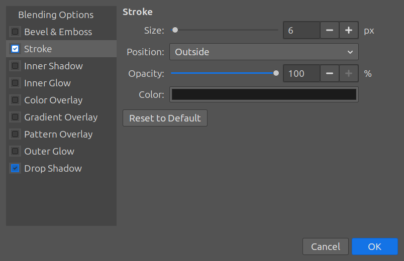
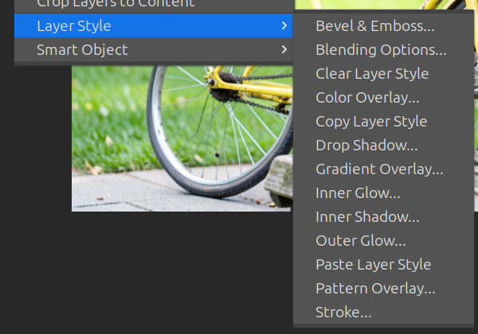
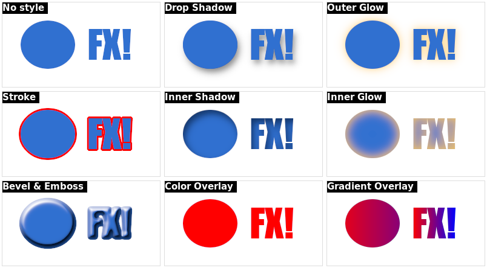
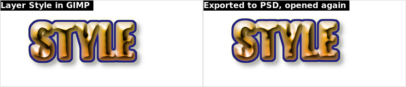

# Layer Style — `features/layer-style.sh`

Photoshop's **Layer Style** dialog (fx) for GIMP 3: drop shadow, stroke,
glows, bevel, overlays, in Photoshop's own terms, non-destructive and
editable again at any time.

## Where it is

*Layer → Layer Style*:

| Entry | Photoshop equivalent |
|---|---|
| **Blending Options…** | double-click a layer / *Layer Style → Blending Options* |
| **Drop Shadow… / Stroke… / …** | *Layer Style → Drop Shadow…*: opens the dialog on that effect, ticked |
| **Copy / Paste / Clear Layer Style** | the same commands; Paste and Clear work on every selected layer |

GIMP plug-ins cannot add a button to the Layers panel's footer, but GIMP
3.2's own **fx** column in the Layers panel shows which layers have effects
and lists them: each effect is a filter named *Layer Style: …*.

## The dialog

Like Photoshop's: the effects on the left (tick to enable, click the name to
edit), their settings on the right, **live preview on the canvas**, OK /
Cancel. Changing a setting of an unticked effect ticks it. OK is one undo
step; Cancel puts everything back. *Reset to Default* restores Photoshop's
defaults for that effect. *Blending Options* holds the layer opacity.

| Effect | Settings | Drawn by |
|---|---|---|
| Drop Shadow | colour, opacity, angle (+ Use Global Light), distance, spread, size | `gegl:dropshadow` |
| Inner Shadow | colour, opacity, angle (+ Use Global Light), distance, choke, size | `gegl:inner-glow` |
| Outer Glow | colour, opacity, spread, size | `gegl:dropshadow` |
| Inner Glow | colour, opacity, choke, size | `gegl:inner-glow` |
| Stroke | size, position (outside / inside / center), opacity, colour | `gegl:styles` outline + `gegl:inner-glow` |
| Bevel & Emboss | technique (smooth / chisel hard), depth, direction, size, angle (+ Use Global Light), altitude, light mode | `gegl:bevel` |
| Color Overlay | blend mode, colour, opacity | `gegl:color-overlay` |
| Gradient Overlay | blend mode, opacity, two colours, reverse, angle, scale | `lb:effects` (LinuxBeaver) |
| Pattern Overlay | blend mode, opacity, an image file | `lb:effects` (LinuxBeaver) |

**Use Global Light** shares one angle between the shadows and the bevel of
the image, as in Photoshop (stored with the image).

The settings are kept on the layer (parasite `gimp-setup-layer-style`, in
Photoshop's units), so the dialog shows exactly what was set. The filters
are rebuilt in Photoshop's stacking order (overlays, inner effects, bevel,
stroke, outer glow, drop shadow) after each change; filters you added
yourself are left alone, before them.

## PSD

With [PSD with editable text](PSD_TEXT.md), a PSD's Layer Styles open as
Layer Styles (stroke, drop and inner shadow, outer and inner glow, bevel,
color and gradient overlay), and on export to PSD every effect is written
back as the matching Photoshop effect with the same settings:

## Limits

- **Satin**, **Contour**, noise, and the shadow/glow blend modes have no
  GEGL counterpart: shadows and glows are always drawn normally.
- Effects are drawn by GEGL, not by Photoshop's engine: close, not
  identical (bevel highlights, glow falloff).
- Fill Opacity (inner opacity separate from the effects) is not available.
- Opening the dialog needs one selected layer; the menu entries are grey
  otherwise.
