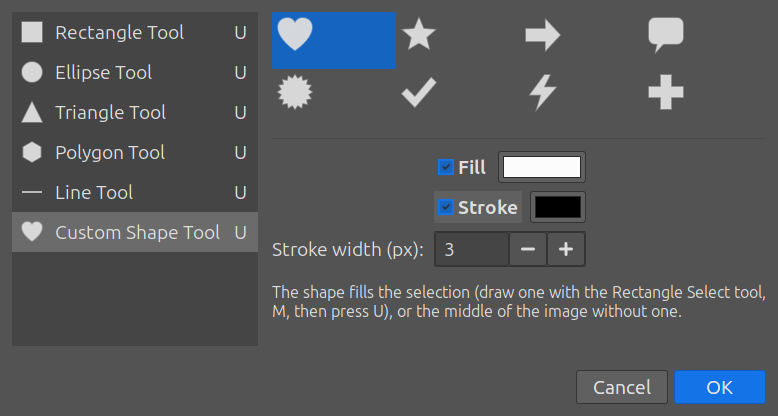
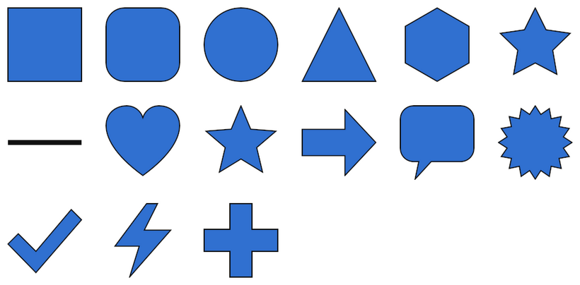

# Shape Tool — `features/shape-tool.sh`

Photoshop's shape tools (**U**) for GIMP 3.2: Rectangle, Ellipse, Triangle,
Polygon, Line and Custom Shape, drawn as **vector layers**, which stay
crisp at any size and keep their fill and stroke editable.

## Use

1. Draw where the shape goes with the **Rectangle Select** tool (`M`):
   the selection plays the part of Photoshop's drag. Without a selection
   the shape goes in the middle of the image.
2. Press **`U`** (or *Tools → Shape Tool…*, *Layer → Shape Tool…*).
3. Pick the tool on the left, as in Photoshop's flyout, and its options
   on the right. The shape previews live on the canvas. **OK** adds it as a
   new layer named after the shape, in one undo step, and drops the
   selection.

| Tool | Options |
|---|---|
| Rectangle | corner radius |
| Ellipse | — |
| Triangle | — |
| Polygon | sides, star, star ratio |
| Line | direction (horizontal, vertical, two diagonals), weight |
| Custom Shape | heart, star, arrow, speech bubble, burst, check mark, lightning, cross |

All tools have **Fill** (colour; the foreground colour by default) and
**Stroke** (colour and width). The last settings are remembered.

## Edit a shape

Select a shape layer and press **`U`** again: the dialog edits it (tool,
colours, stroke, radius…). Its points can also be moved with GIMP's
**Path** tool (`B`), and the vector layer redraws; moving the layer with
the Move tool works as usual. Layer Styles
([Layer Style](LAYER_STYLE.md)) work on shape layers too.

## Limits

- GIMP plug-ins cannot add buttons to the toolbox, so the shapes live
  behind `U` and the Tools menu instead of a toolbox flyout, and the box
  comes from a selection rather than a drag with the tool itself.
- Exporting to PSD writes shape layers as pixels (no Photoshop shape
  layers).
- Needs GIMP 3.2+ (vector layers); on older GIMP the menu is not added.
